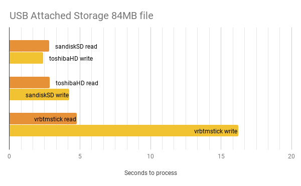

### Why
In effort to make maintenance, backups, and recovery a little more managable I chose to move the following directories to USB removable storage.  I use a rotation of 5 micoroSD cards so my concerns about wearing out the microSD cards were minimal.

- /var/log   
  - active file directory
  - "state" of the system
- /home/homeassistant/.homeassistant
  - Home Assistant database
  - YAMLs
  - All the "stuff" needed by HA
  
This set up allows me to swap the micorSD cards and boot up to a fuctioning Home Assitant instance that is current as of the shutdown/failure.

### The Plan

- Have my buddy at amazon send me a couple verbatim 16gb thumb drives
- Do those fancy mount what use the UUID of the disk so it doesn't matter what port the drive is plugged in to 
  -  ```ls -l /dev/disk/by-uuid/```
  - create mount points
    - real
    - temp
    - update /etc/fstab
  - shutdown HA
  - ```sudo mount -a```
  - move data in /home/homeassistant/.homeassistant to temp mount point
  - ```sudo chown``` 
  - ```sudo chmod```
  - ```mount -a```
  - lots of ```ls -la```
  - reboot 
  
  
  The addtions to /etc/fstab look like this ```timeout=1``` continues boot after one second if drive not available
```
    ## this is the thumb drive
    UUID=beed2112-beed-2112-beed-2112beed2112 /var/log  ext4    defaults,noatime,nofail,x-systemd.device-timeout=1  
 0       1
    ##  usb fob with micro sd card 
    UUID=abacaba-beef-feed-2112-abacabacab /home/homeassistant/.homeassistant ext4    defaults,noatime,nofail,x-systemd.device-timeout=1   0  
```
### The first boot

SSH into the system for the first time
- ``` tail -f home/homeassistant/.homeassistant/home-assistant.log ```
- HA restarting
- wemo discovery happening
- **SQLite3 DB put into read only (do I even have still the error messages?)**
- Back off changes 
- Restart


### Learning time 

After a little time with the google I learned that SQLite3 was most likely unhappy because of the **_speed_** of the thumbdrives.  

In one of the discussions I ran across an example that used the ```dd``` command to get some drive speed numbers.

```
#write a big file
sudo dd if=/dev/zero of=./largefile bs=1M count=1024

# flush
sudo sh -c "sync && echo 3 > /proc/sys/vm/drop_caches"

# read bs=1m
sudo dd of=/dev/zero if=./largefile bs=1M 
```

Used those commands to put together a quick and dirty cut and pasty kind of script to make it easy to repeat and get the information.

```
# write  file 1   1gb
res=`sudo dd if=/dev/zero of=./largefile bs=1M count=1024 2>&1 | grep copied`
echo "write, $res, bs=1m"

# flush
sudo sh -c "sync && echo 3 > /proc/sys/vm/drop_caches"

# read bs=1m
res=`sudo dd of=/dev/zero if=./largefile bs=1M 2>&1 | grep copied`
echo "read, $res, bs=1m"

# flush
sudo sh -c "sync && echo 3 > /proc/sys/vm/drop_caches"

```

File size can be controlled by adjusting blocksize (bs) and or count.

Script output
```
write, 1073741824 bytes (1.1 GB) copied, 243.751 s, 4.4 MB/s, bs=1m
read, 1073741824 bytes (1.1 GB) copied, 61.2597 s, 17.5 MB/s, bs=1m
```

## Drives 

toshibaHD
```
[sda] Attached SCSI removable disk
scsi 1:0:0:0: Direct-Access     TOSHIBA  External USB 3.0 0001 PQ: 0 ANSI: 6
sd 1:0:0:0: Attached scsi generic sg1 type 0
sd 1:0:0:0: [sdb] 1953525168 512-byte logical blocks: (1.00 TB/932 GiB)
```

vrbtmstick
```
scsi host0: usb-storage 1-1.4:1.0
scsi 0:0:0:0: Direct-Access     Verbatim STORE N GO       1100 PQ: 0 ANSI: 4
sd 0:0:0:0: Attached scsi generic sg0 type 0
sd 0:0:0:0: [sda] 30535680 512-byte logical blocks: (15.6 GB/14.6 GiB)
```

sandiskSD

Not sure why the manufacturer is not showing -> sanDisk Ultra. 
Might have something to do with the [Rocketek card reader](https://www.amazon.com/Rocketek-Aluminum-Portable-Memory-Adapter/dp/B06XTQZS4F/ref=lp_8437183011_1_2?srs=8437183011&ie=UTF8&qid=1513366096&sr=8-2/) 
```
sd 1:0:0:0: [sda] 62333952 512-byte logical blocks: (31.9 GB/29.7 GiB)
sd 1:0:0:0: [sda] Attached SCSI removable disk
```


Results of transfer tests

Not a needs to be said here.





## Current State

- /var/log  -> Verbatim STORE N GO 
- /home/homeassistant/.homeassistant -> sanDisk Ultra

The toshiba drive is used on another PI to store card images


